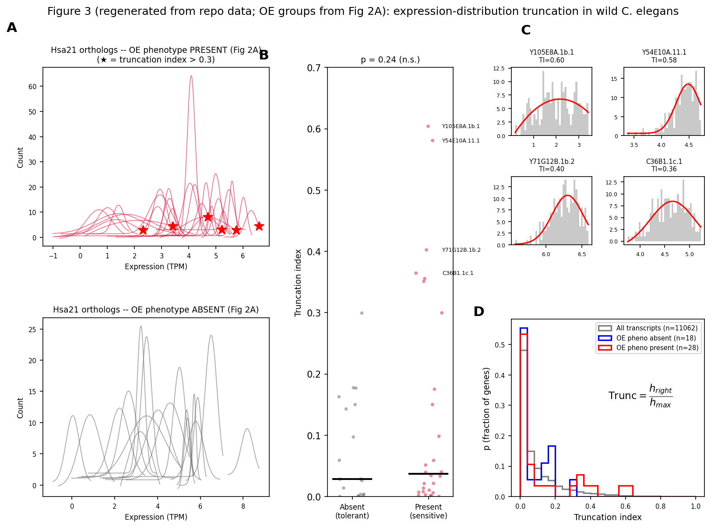
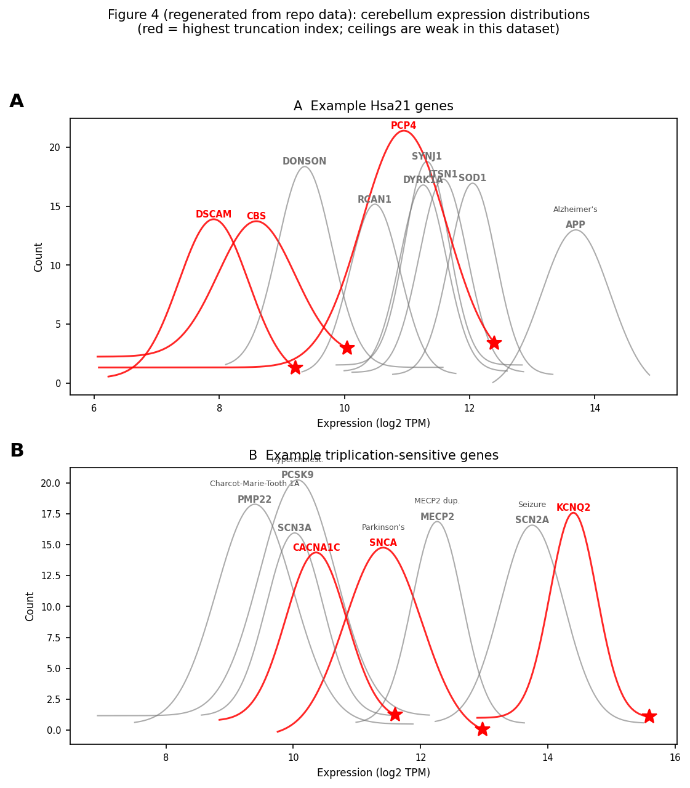

# Predicting overexpression thresholds for Down syndrome and Alzheimer's disease genes

**Contact PD/PI: Pierce, Jonathan**

> Converted from `ACFROG~1.PDF` (grant proposal, 5 pages: Specific Aims + Research
> Strategy pages 35–39). Figures 3 and 4 have been **regenerated from this repo's
> data** (see [Regenerated figures](#regenerated-figures) and
> `regenerate_acfrog_figures.py`); Figures 1 and 2 are hand-drawn diagrams / gene
> tables in the original and are described but not reproduced.

---

## Specific Aims

Gene overexpression (OE) contributes to many medical conditions. For instance, the
intellectual and motor phenotypes associated with Down syndrome (DS) are caused by an
undefined subset of OE-sensitive genes on the 21st chromosome (Hsa21). Likewise, other
genes cause or worsen neurodegenerative conditions alone (e.g. *APP* and alpha
synuclein / *SNCA*) or in combination with other genes (e.g. *APOE* and tau) when
overexpressed. Although many genes are hypothesized to have an OE threshold, no one has
found a way to visualize these hypothetical thresholds across genes. The challenge is
largely because humans and other animals appear to tolerate a range of expression levels
for most genes — even an extra copy. Thus, discovering a universal way to predict which
genes have an OE threshold singly or in combination with other genes would transform
neurogenetics. With this knowledge, scientists may better understand disease origins and
develop treatments.

We recently discovered a surprisingly simple pattern in the natural levels of gene
expression that predicts OE thresholds for genes in both the nematode *C. elegans* and
humans. To test which genes may cause OE phenotypes with relation to DS, we
overexpressed 48 conserved orthologs of Hsa21 genes one at a time in worm. As expected,
we found that many (20) genes did not cause phenotypes. We also discovered other genes
(28) that cause abnormal development and/or nervous system function when overexpressed.
Our follow-up genotype–phenotype analyses suggest mechanistic origins for DS-related
phenotypes (e.g. axon guidance, neuronal hyper- or hypo-activity, and developmental
delay).

Using data mining to consider dozens of factors, we found that the pattern of gene
expression level observed across the wild population of *C. elegans* provided a clear
predictor for OE sensitivity. Across 208 wild strains, most genes are expressed across a
low–medium–high range that forms an expected Gaussian distribution of expression levels.
However, all genes that had a ceiling in their expression level caused an OE phenotype —
as if higher levels were incompatible with fitness and survival in nature (censored in
clinical-trial parlance). In contrast, none of the OE-tolerant genes had an expression
ceiling. This model predicted genes in independent studies that caused OE phenotypes by
transgenes or by derepression of microRNA genes.

Importantly, this OE threshold hypothesis can be generalized to humans. If a gene is
OE sensitive, then the distribution of gene expression levels across healthy individuals
should be capped at a ceiling that signifies the threshold above which would cause a
deleterious phenotype. If a gene is OE tolerant, however, it should display an uncapped
Gaussian distribution of expression levels across healthy individuals. Indeed, we found
support for our hypothesis with positive and negative controls. In tissue obtained from
hundreds of healthy people in the GTEx study, many OE-sensitive genes (positive control)
exhibit a ceiling of expression (e.g. genes that cause single-gene triplication disorders
*APP* — Alzheimer's disease, *SNCA* — Parkinson's disease, and *PCSK9* —
hypercholesterolemia) as well as most of 1,400 genes predicted to be triplication
sensitive (Collins et al., 2022). Conversely, we found that most of 774
triplication-tolerant genes (negative control) do not display an expression ceiling. We
hypothesize that an expression ceiling represents the OE threshold for a gene, and the
ceiling is explained by the inadvertent censoring of unhealthy people from the GTEx study.

We propose to empirically test the OE threshold hypothesis to predict which genes, singly
or in combination, cause OE phenotypes related to DS and Alzheimer's disease (AD) through
complementary aims:

**Aim 1: Develop a predictive model for combinatorial OE thresholds for DS and AD genes
in human.**
1.1) Quantify differences from the healthy distribution function to predict which Hsa21
genes, singly and in combination, lead to deleterious phenotypes in the context of DS
across tissues. 1.2) Develop a statistical tool to quantitatively predict which Hsa21 and
AD-risk genes (*APP* and *APOE*) lead to deleterious phenotypes at what levels with other
genes in combination genome-wide. 1.3) Test advanced predictive power of our gene
expression model with alternate models. 1.4) Empirically test gene expression interactions
with our established *C. elegans* model of *APP*- and *APOE4*-induced age-related
tau-dependent patterned neurodegeneration.

**Aim 2: Test how the model quantitatively predicts overexpression phenotypes in worm.**
2.1) Quantitatively test the OE threshold model by incrementally ramping up or down
expression of individual Hsa21 orthologs relative to the expression ceiling through copy
number and expression modulation methods in *C. elegans*. 2.2) Mechanistically test how
Hsa21 ortholog gene interactions influence DS-related phenotypes in axon integrity and
neurotransmission through quantitative expression relationships in *C. elegans*.

This represents the first genome-wide analysis of how gene expression levels interact to
cause deleterious OE phenotypes in relation to DS (Hsa21 genes) and AD-related
neurodegeneration (*APP*, *APOE*, and tau). We will also quantitatively test our
predictive model for causation with hundreds of newly engineered animals and genetic
manipulations in *C. elegans*. Identifying OE thresholds and their interactions will inform
novel treatments to push expression into healthy ranges for a myriad of severe medical
conditions in future studies.

*(Specific Aims — Page 35)*

---

## Importance of the Research

**Significance.** Gene overexpression (OE) remains understudied compared to
loss-of-function (LF) and gain-of-function (GF) mutations, which have yielded thousands of
causal variants [1]. While LF and GF typically involve absent or abnormal protein
products, OE entails excessive expression of an otherwise normal gene. Only a few genes
have been experimentally confirmed to cause disease through OE, often due to triplication
or regulatory mutation [2]. Yet OE has major health impacts: about 2M Americans carry
pathogenic duplicated CNVs, including 200k with DS [3,4]. Moreover, OE modifies the
severity of numerous diseases, such as Alzheimer's disease (AD), which affects 7.5M
Americans [5]. In AD, triplication of *APP* invariably leads to early-onset AD in DS, while
regulatory variants increasing *BIN1* expression exacerbate disease risk and progression
[6,7,8,9]. Thus, more study of OE is essential to uncover how increased gene dosage
contributes to human pathology.

**Why the gap in knowledge regarding gene OE?** Consider DS research. Despite 70 years of
knowing that DS results from full or partial trisomy of Hsa21, progress has been slow in
tracing its phenotypes to a subset of roughly 200 Hsa21 genes [10]. Study of OE has been
hampered by the challenge to study so many genes at scale with the traditional mouse model
[11]. Only 20 Hsa21 genes have been studied for their individual contribution so far, and
most Hsa21 genes have not been studied in depth (Fig. 1A, [12]).

Adding to the challenge, guessing which genes cause OE phenotypes is hard because many
genes are OE tolerant [1]. Recent pangenome studies have revealed that healthy individuals
carry on average 32 extra genes [13,14]. Overall, 1,400 genes were triplicated in people
with 700 genes tolerated as extra in more than one person. Clearly, new ways of thinking
about gene OE and higher-throughput experimental strategies are required to make progress
on the problem of gene OE in DS as well as in myriad other conditions [17].

**How are researchers currently studying gene OE?** To investigate which genes cause OE
phenotypes, recent studies have correlated CNV or expression patterns in people with and
without triplication disorders [18,19,20]. One study developed predictive scores for
triplication sensitivity (pTriplo) by correlating rare CNVs from 1M individuals with 54
conditions [21]. This represents the first genome-wide quantitative map of dosage
sensitivity, providing a framework for interpreting CNVs in diagnostics. In another study,
the Human Trisome Project compared transcriptomics of hundreds of people with DS and their
siblings [22]. People with DS separated into three subtypes based on gene expression.
Individuals who displayed OE of interferon receptors on Hsa21 displayed chronic immune
hyperactivation, which may underlie high autoimmune disease rates in DS.

**Although powerful, what are the limitations of these approaches? And solutions?**
Detection of duplications is less reliable than for deletions, creating uncertainty in
triplosensitivity estimates [23]. It also remains to be seen whether pTriplo pertains to OE
in cases where genes are overexpressed but not triplicated. This suggests many false
negatives. → Thus, an approach that allows genome-wide analysis of OE sensitivity
irrespective of whether the gene is represented as triplicated in a patient would be ideal.
A systematic gene-by-gene approach would be important to distinguish which subset of genes
in CNVs drive OE phenotypes. Moreover, the pTriplo model cannot account for tissue-specific
effects or complex gene interactions that shape dosage sensitivity in vivo. → An approach
that enables inspection of gene OE throughout tissues and quantifies gene expression level
interactions would represent a major improvement.

Confirmation of these correlative studies requires new control and patient genome
datasets, yet this is challenging because gene OE events are often rare and new DS patients
hard to recruit [24][25]. Moreover, validation requires advancing from correlation to
causation. → Unfortunately, mice cannot be used to test over 100 candidate genes at
different dosages for OE sensitivity.

> **Figure 1: *C. elegans* screen of Hsa21 genes.** *(Original: conceptual diagram — not
> regenerated.)* **A)** Word cloud depicts the uneven study of Hsa21 genes on PubMed with
> font size on log scale. **B)** About 1/3 of 213 protein-coding Hsa21 genes (or over
> half, excluding keratin) have a worm ortholog. **C)** One can easily thaw a LF mutant or
> RNAi treatment from freezer. **D)** One can also easily inject worm to overexpress one or
> more genes with regulatory sequence in combination for multi-copy array or single-gene
> knock-in. **E)** Example phenotypes assayed in our recent LF and OE screens ([15,16], and
> unpublished observations): lethality, pharyngeal pumping, sensitivity, short-term
> locomotion, long-term locomotion, egg retention, egg laying/stage, development.

*(Research Strategy — Page 36)*

---

Likewise, human cell lines hold potential to study dozens of genes, but cannot easily be
used to study if gene OE causes tissue- or age-related phenotypes. An animal model with
facile genetics and phenotyping is needed to tackle the problem of gene OE.

The Human Trisome Project profiles transcriptomics from blood, but this misses OE in other
tissues [26]. → An approach that studies OE throughout human tissues, especially brain, is
needed to understand DS phenotypes.

Our proposal offers the solutions above to address fundamental questions related to gene
OE. 1) Do genes have quantifiable OE thresholds? 2) Is there a general strategy to detect
OE thresholds across all genes? Across species? 3) Which Hsa21 genes contribute to which OE
phenotypes singly or in combination in DS? 4) Which genes in the genome enhance or suppress
the neurodegeneration caused by *APP* and other AD-risk genes *APOE* and tau? 5) Does
variable penetrance or expressivity of a condition relate to the type of OE threshold?

**Significance of the Expected Research Contribution.** Completing this proposal, we will
develop quantitative analyses to predict which Hsa21 genes cause OE phenotypes — alone or
in combination — and at what expression levels across human tissues. We will extend these
analyses to key AD genes (*APP*, *APOE*, and tau) [27]. In Aim 1, we will experimentally
test genes predicted to modify *APP*- or *APOE*-related degeneration using novel transgenic
*C. elegans* models. In Aim 2, we will examine OE thresholds by generating new worm strains
with graded expression of Hsa21 orthologs. Together, these studies will identify candidate
genes whose modulation could restore normal development and health in DS and AD.

### Rigor and Feasibility

**Innovation.** We offer new experimental, conceptual and analytical approaches to fill
this gap in knowledge.

**Experimental innovation.** Normally DS research is limited by the challenge to
experimentally alter the expression of dozens of Hsa21 genes singly and in combination.
After years of preparation, we have developed a feasible approach by leveraging the genetic
strengths of *C. elegans*, generating a library of transgenic and mutant worms (Figs. 1 &
2).

Previously, we found that, excluding keratin, *C. elegans* has orthologs for 85 of the
remaining 150 Hsa21 protein-coding genes (Fig. 1B). To study genes that are conserved, we
have used their worm ortholog, first focusing on the 48 that are highly conserved [15]. For
genes that are not conserved, we can "humanize" the worm by expressing the human gene. For
instance, we have found that expressing *APP* caused age-related neurodegeneration that can
be easily inspected through the worm's transparent body [28]. We also found that human
*APOE4*, but not *APOE3*, exacerbated *APP*-induced neurodegeneration mirroring the pattern
of pathogenicity in human AD [29][30][31]. Our worm models represent a powerful platform to
investigate cellular–molecular bases for how AD-risk genes initiate and spread neuronal
dysfunction and degeneration in a fully characterized compact nervous system.

As a prelude to study OE of Hsa21 genes, we performed KO and knockdown of each
highly-conserved Hsa21 ortholog (Fig. 1C & Fig. 2). In this LF screen, we identified 20
genes essential for viability, and novel roles for two genes, *PDXK1* and *N6AMT1*, in
synaptic transmission. Many of these genes were missed in historic screens [32][33],
demonstrating the power of our approach to systematically screen genes.

Recently, we completed the converse OE screen. We overexpressed 47 Hsa21 orthologs
one-by-one in worm and assessed phenotypes related to development and nervous system
function (Fig. 1D). For this first pass, we used a multicopy gene OE approach to minimize
false negatives. We reasoned that if excessive OE did not produce an OE phenotype, then
that gene is confidently OE tolerant. Overall, 28 genes were OE sensitive, causing
abnormalities in development and/or in neural function, while 20 genes were OE tolerant
(Fig. 2).

The results of our LF and OE screens not only provide insight into the function and OE
sensitivity of Hsa21 orthologs, but also position our team with a critical library of
*C. elegans* strains to study how ramping gene expression up or down influences OE
phenotypes in our proposal.

> **Figure 2: Hsa21 orthologs and phenotypes in *C. elegans*.** *(Original: gene table —
> not regenerated.)* **A)** Orthologs of 48 highly-conserved human genes were overexpressed
> (except *pad-1*). Shaded cells indicate experiment-wide significant multi-copy OE (mcOE)
> or LF phenotypes (Any / Developmental / Behavioral). Three worm genes (*irk-2*, *rrp-1*,
> and *K02C4.3*) are orthologous to paralogs in human. **B)** Which genes had mcOE, LF,
> both, or no phenotypes: mcOE screen — 11 genes; LF screen — 13 genes; both — 11 genes;
> no phenotype — 10 genes. (Nordquist et al., 2018; unpublished.)
>
> *Extracted from the table cells (used to define the OE groups in Fig. 3):*
> **OE-sensitive (mcOE phenotype, 24):** chaf-2, cle-1, dip-2, dnsn-1, eva-1, pat-3, irk-2,
> Y54E10A.11, mrps-6, ncam-1, F43G9.12, pdxk-1, pfk-1.1, rcan-1, rrp-1, nrd-1, Y105E8A.1,
> hlh-34, sod-1, D1037.1, unc-26, Y74C10AL.2, trpp-10, K02C4.3.
> **OE-tolerant (no mcOE, 23):** adr-2, atp-3, B0024.15, cbs-1, cct-8, D1086.9, H39E23.3,
> igcm-1, mbk-1, F38B6.4, stc-1, itsn-1, zig-10, mrpl-39, mtq-2, pes-4, pad-2, ikb-1, rnt-1,
> set-29, sod-5, ubc-14, wdr-4.

*(Research Strategy — Page 37)*

---

## Regenerated figures

> **Regeneration note (important).** The two data figures below are **faithful
> reproductions from the current repo data** (`worm.csv` / `cerebellumlog2.csv` + the
> excluded-at-or-below-−1 fourparam tables + `bhuvanfitter.BhuvanFitter`), produced by
> `regenerate_acfrog_figures.py`. They **intentionally do not reproduce the strong
> "expression ceiling" separation** drawn in the original proposal:
>
> - **Worm (Fig. 3):** OE groups are taken from **Figure 2A** (mcOE-"Any" column = OE
>   sensitive; no mcOE = OE tolerant), *not* from `genes_of_interest.json` — the json
>   lacked the OE-tolerant no-phenotype genes that form the correct "absent" control. With
>   the proper control, the qualitative pattern **does** appear as a **tail effect**:
>   OE-tolerant genes are capped (max TI ≈ 0.30, 94% below 0.2) while OE-sensitive genes
>   spread out to 0.60 (25% above 0.2). The center/median is similar for both, so
>   Mann-Whitney is only **p ≈ 0.24 (n.s.)** — weaker than the proposal's *p < 0.004*
>   (likely the older *unbounded* truncation-index metric or a per-gene test amplified it),
>   but the direction and the tolerant-genes-are-capped result are real.
> - **Cerebellum (Fig. 4):** the classic triplication genes (*APP*, *SOD1*, *SNCA*,
>   *RCAN1*, *PCSK9*, *MECP2* …) come out as mid-range Gaussians with tapering right tails;
>   their truncation indices are ≈ 0, consistent with the repo's own section-5 finding that
>   truncationindex is ~uncorrelated with pTriplo (ρ ≈ −0.01). The original Fig. 4 also
>   used a different expression scaling (x-axis 0–8 for 212 people) than
>   `cerebellumlog2.csv` (log2 ≈ 6–15 for 266 samples).
>
> In the regenerated figures, red curves / ★ mark the **relatively** highest-truncation
> genes, not a validated ceiling threshold.

### Figure 3 — Expression-distribution truncation in wild *C. elegans*

OE-sensitive vs OE-tolerant status is read from **Figure 2A** (24 sensitive / 23 tolerant
Hsa21 orthologs; the 3 merged human/worm rows resolve to *irk-2*, *rrp-1*, *K02C4.3*, all
sensitive; *pad-1* = n.d.), mapped to fourparam-table transcript IDs via the Supplementary
Data 1 gene↔transcript mapping. **A)** Overlaid 4-parameter Gaussian fits of natural
expression level across wild *C. elegans* for Hsa21 orthologs: OE phenotype **present**
(red, top; ★ = truncation index > 0.3) and **absent** (grey, bottom). **B)** Truncation
index for OE-tolerant (absent) vs OE-sensitive (present) genes; horizontal bars = medians.
**C)** Four example OE-sensitive genes (histogram + red Gaussian fit). **D)** Truncation-index
histograms as per-bin fraction `p` (matching the original's axis) for all transcripts
(grey), OE phenotype absent (blue) and present (red) — **the tolerant/blue curve is capped
near TI ≈ 0.3 while the sensitive/red curve extends to 0.6.** `Trunc = h_right / h_max`.

*Original caption (Fig. 3):* "All genes that exhibit expression ceilings caused OE
phenotypes. A) Gaussian fits show distributions of natural expression level for genes
across wild *C. elegans*. Most distributions are uncapped, but more than half that caused
OE phenotypes exhibited ceilings (red with *). The same pattern was observed for 13 genes
from independent worm studies (bottom). None of the OE-tolerant genes showed ceilings. We
hypothesize that the ceiling represents an OE threshold. Some OE-sensitive genes were
uncapped; we hypothesize these are caused by extreme OE or other mechanisms. B) Ceilings
were quantified by a truncation index (ratio of the truncated right-side of the
distribution to the peak). Genes that caused OE phenotypes had significantly higher
indices. C) Example expression distributions for 4 genes (peaks and truncated sides in
red). D) Data in B shown as normalized histograms compared to all transcripts."

**Conceptual and analytical innovation.** Which genes cause OE phenotypes? Here, we present
a new way to think about this question. By performing data mining on our *C. elegans* OE
screen, we identified a single overlooked factor in public data that strongly predicts OE
sensitivity. When analyzing the natural distribution of expression levels for wild strains
[34], we found that most genes displayed an expected Gaussian distribution (Fig. 3A),
presumably due to the central limit theorem. In contrast, all genes that had a ceiling in
their expression distribution were OE sensitive in our screen. This suggests that the
ceiling in the expression level distribution marks an OE threshold above which would
decrease fitness in the wild — an idea backed up by our empirical finding of decreased
growth, locomotion and reproduction. Conversely, all genes that were OE tolerant in our
screen were uncapped in their expression level distribution. This suggests that the gene
may be overexpressed safely without deleterious effect — again, an idea backed by our
experiments.

Importantly, this pattern generalized to humans. Genes with ceilings in their distribution
of expression levels across healthy subjects in the GTEx dataset were more likely to be
associated with known OE phenotypes (Fig. 4). Conversely, genes that are known to be OE
tolerant in the recent pangenome studies were more likely to be uncapped, displaying a full
Gaussian distribution. Thus, our conceptual innovation is noticing that OE sensitivity
correlates with the shape of the distribution of gene expression level.

We have already developed a simple but effective predictive score for OE sensitivity based
on the degree of distribution truncation. Here, we propose to develop improved metrics to
quantify differences between gene expression distributions of OE-sensitive and OE-tolerant
control genes. This new analytical approach will both predict OE sensitivity and determine
OE thresholds for genes considered singly and in combination with others.

**The Team.** We have assembled a collaborative team at UT Austin with complementary
expertise in *C. elegans* molecular genetics, computational biology, and data science. The
Pierce lab pioneered use of the worm to study DS mechanisms, creating the first *APP* model
of neurodegeneration and systematic Hsa21 gene screen [28,15]. The Wei lab developed
advanced statistical approaches revealing patterns of neuronal activity and complex
behavior (e.g., [35,36]). Our team is well suited to study and predict OE sensitivity
contributing to DS and AD by pairing powerful statistical analyses with *C. elegans*.

*(Research Strategy — Page 38)*

---

### Figure 4 — Human OE-sensitive genes: cerebellum expression distributions

**A)** Example Hsa21 genes and **B)** example triplication-sensitive genes: overlaid
4-parameter Gaussian fits of expression across GTEx cerebellum samples. Red curves / ★ mark
the genes with the highest truncation index in each panel; grey = the rest. Disease
associations are annotated where applicable.

*Original caption (Fig. 4):* "Human OE-sensitive genes exhibit expression ceilings.
Expression distributions for genes in cerebellum across 212 people from GTEx. Most genes
that cause severe medical problems when triplicated have ceilings. We hypothesize that
expression higher than the ceiling might preclude subjects from participating due to a
medical issue. A) Hsa21 genes shown in red exhibit ceilings and cause OE phenotype in human
or mouse as an extra copy. B) Most well-known genes that cause a medical condition when
triplicated displayed expression ceilings."

---

## Rigor of Prior Research Supporting the Aims

*C. elegans* is a proven model to elucidate cellular–molecular functions of genes relevant
to DS and AD. Its small size, transparency, and rapid reproduction make it ideal for
genetic and neurobiological research [37]. With 302 well-defined neurons, it enables
tracking of individual cells through development and aging. Discoveries in apoptosis, axon
guidance, mechanosensation, and aging in worm parallel human biology. The first genetic
screen identified a mutant in the Hsa21 gene *SYNJ1*, revealing its conserved role in
synaptic vesicle recycling [32]. Its mapped connectome facilitated studies of guidance
molecules such as Netrin; enhancer screens uncovered *eva-1* as a co-receptor, implicating
Hsa21 *EVA1C* in axon guidance [38]. Our lab showed OE of *SYNJ1* and *EVA1C* orthologs
causes developmental and behavioral phenotypes (Fig. 2). Interest in Hsa21 *DONSON* arose
after its mutations caused microcephalic dwarfism [39], and worm studies revealed its role
in replication-fork assembly [40]. We also found that Hsa21 *APP*, sufficient to cause AD in
DS, induces neuronal degeneration in worm [28]. Thus, the worm provides a powerful minimal
in vivo model for human gene function and dysfunction.

*C. elegans* is also a proven model for uncovering fundamental genetic mechanisms relevant
to humans. Owing to its facile genetics and large sample sizes, Fire and Mello used the
worm to show that double-stranded RNA silences gene expression in a sequence-specific
manner, leading to RNAi as a powerful tool for gene knockdown and post-transcriptional
regulation [41]. Ambros, Ruvkun, and colleagues later discovered the first microRNA genes,
launching the field of miRNA research and revealing a conserved layer of gene regulation
[42,43]. These landmark discoveries earned two Nobel Prizes.

Our OE threshold hypothesis may represent a new example of how a fundamental genetic
principle is more easily discovered in the tractable worm before scientists realize its
occurrence across in humans.

**Limitations.** There are certain human genes and tissues that *C. elegans* cannot easily
model. Despite this issue, the worm has been leveraged to study genes at scale in ways that
simply are not possible in other systems [44]. Moreover, we focus on human genes in Aim 1
and worm orthologs of human genes in Aim 2. When needing to study human genes not conserved
in worm, we will "humanize" worms by expressing the human gene. The GTEx tissues serve as
one of the best population-level "normal" controls [45]. Nevertheless, they are derived from
deceased organ donors, many of whom had mild age-related or underlying conditions. Although
overtly diseased tissues were excluded after pathological review, remaining samples may
still reflect subclinical or age-associated pathology rather than perfect health [46].

## Aim 1: Develop a predictive model for OE thresholds for DS & AD genes in human

**Overview: the Censoring Hypothesis.** Our goal is to develop and experimentally test new
powerful computational approaches to help identify genes as potential therapeutic targets
for DS and AD. These new methods are guided by a principled theoretical consideration, which
we will refer to as the Censoring Hypothesis (Fig. 5). The basic idea is that the true
distribution of gene expression levels for individuals in a population is expected to have
an approximate Gaussian shape in the TPM (transcripts per million reads) log2 scale.
However, if a single gene causes a deleterious phenotype when expressed past a threshold,
effectively censoring the individual from participating in the study (censoring), the
distribution will change on the right tail. For *C. elegans*, phenotypic severity relates to
evolutionary fitness for the wild strains. For humans, severity reflects a medical condition
that would preclude joining the GTEx study. Similarly, deviation from Gaussian on the left
side would reveal expression level floors for genes that are haploinsufficient or require a
minimal threshold for survival or health. This line of reasoning strongly suggests that the
distribution of gene expression levels from healthy controls contains critical information
regarding whether the OE of a gene would cause a phenotype. Our preliminary results reported
in Figs. 3 and 4 provide support for the validity of this hypothesis. In this Aim, we will
develop a […]

*(Research Strategy — Page 39)*
